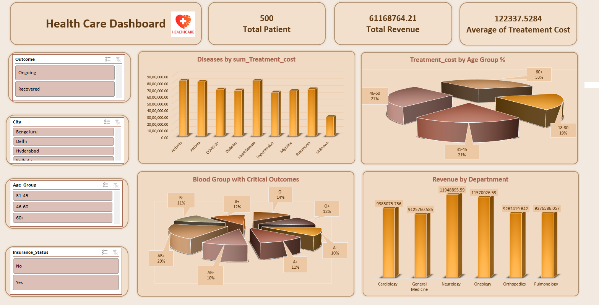

# Healthcare Data Analysis Project

## About this Project 

this project of hospital patient data .solve some business question like which age group patient required more treatment cost etc.. 

in it i work in 3 parts 
1. Cleaning data, Preprocessing (Python)
2. Answer business question (SQL)
3. Showing visually (dashboard in Excel)

## The dataset

the raw file in it there are 515 rows and 15 columns in it there are patient information like age, gender, blood group, BMI, disease, department, city, admission dates, discharge dates, treatment cost, insurance status, and outcome.

## Step 1 — Cleaning the data using Python(`Data_Preprocessing.ipynb`)

 steps:

- **Removed columns that didn't important** — `Height_cm` and `Weight_kg`.
- **Removed duplicate rows** —  There are 15 Duplicates rows ,515 rows to 500 rows t.
- **Check missing values** — missing values in coulmns  Age, Gender, Blood_Group, Disease, and Treatment_Cost in it found .
- **Filled missing values** — filling values according there info using mean , median visualize the data for understand outliers and all .
  - **Age** i can visualize Age column there are found Outliers therefor i used **median**.
  - **Treatment_Cost** in it not show outliers therfore, fill using **mean** value.
  - **Gender** and **Blood_Group** were filled using the **mode** .
  - **Disease** is fill by `Unknown` because guess the disease is bad.
- **Fixed date columns** — `Admission_Date` and `Discharge_Date`  convert into date format .
- **Saved the cleaned file** as `cleaned_healthcare_realistic_dataset.csv` — this file used every where for analysis and dashboard for all.

After clean all We got 500 rows and 13 Columns.

## Step 2 — Business analysis (SQL)

create database and insert the cleaned data in SQL and find insights of following

- Which disease costs the most overall?
- Which department earns the most revenue?
- What's the average treatment cost split by disease and insurance status?
- How much of the total cost is actually covered by insurance?
- Which city has the most expensive treatments on average?
- Which age group spends the most on healthcare?
- What diseases are most common in which age groups?
- Is there a real cost difference between male and female patients?
- Which blood group shows up most in critical cases?

## Step 3 — Dashboard

Create a Dashboard to show meaningful insights , use filter city , Age Group, Insurance Status , Outcomes . according to that show some insights . shown in following image
 

## Insights 

- **Arthritis** has the highest total treatment cost.
- **Neurology** Generate most revenue out of all departments.
- Approx **52% of total treatment cost is by insurance**
- **Insured patients spend more time** than uninsured patients for same disease.
- **Delhi** has highest average treatment cost per patient.
-  **60+ age group** spend highest .
- **Migraine and Asthma**   common among 18-30 Patient .
- **Female patients** more revenue than male patients.
- **AB+ blood group** has highest number of critical outcomes.

## Tools used

- **Python** (pandas, numpy, matplotlib, seaborn) for Preprocessing 
- **SQL** —  answer  business questions
- **Excel** — for the dashboard

## A quick note

This was built as a learning/practice project to apply real data analysis skills — cleaning messy data, asking the right business questions, writing SQL to answer them, and presenting it all in a way a non-technical person could understand. Feedback and suggestions are always welcome.